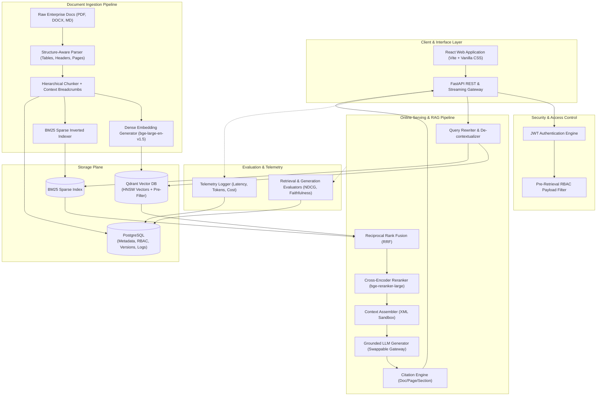

# AI-Powered Enterprise Document Intelligence & Knowledge Platform

> **Current Development Status: Planning & Architecture Phase**  
> *Notice: This repository is currently in its formal engineering design and specification phase. The architectural plans, specifications, and data schemas have been established, and no implementation code or dependencies have been deployed yet.*

---

## 📌 Project Overview

The **AI-Powered Enterprise Document Intelligence & Knowledge Platform** is an enterprise-grade document search, synthesis, version comparison, and evaluation system designed to operate over large, heterogeneous corporate document collections (HR policies, SOPs, engineering runbooks, compliance filings, and vendor contracts).

### Core Architectural Principle
> **The Large Language Model (LLM) is NOT the search engine or database.**  
> The system deterministically retrieves authorized, high-precision evidence using a hybrid retrieval engine (BM25 + Qdrant) combined with cross-encoder reranking. The LLM is used strictly as a grounded reasoning and synthesis engine constrained to the retrieved context.

---

## 🏢 Enterprise Problem & Solution

| The Problem | How Naive AI Fails | Our Engineered Solution |
| :--- | :--- | :--- |
| **Lexical Blindspots** | Keyword search misses synonyms; vector search misses error codes and clause IDs. | **Hybrid Retrieval (Dense + BM25)** combined via **Reciprocal Rank Fusion (RRF)**. |
| **Low Initial Precision** | Vector search surfaces irrelevant candidate passages that consume context. | **Cross-Encoder Reranking** performing deep token-to-token cross-attention. |
| **Hallucination & Fabrications** | LLMs invent facts when evidence is incomplete or ambiguous. | **Strict Grounding Guardrails** with auditable `[Doc, Page, Section]` citations. |
| **Data Leakage & Security** | Standard RAG has zero access control; post-filtering leads to empty results. | **Pre-Retrieval RBAC Filtering** at the vector and sparse index levels. |
| **Policy Contradictions** | Manually comparing updated policies across departments is error-prone. | **Document Version Diffing & Semantic Conflict Detection**. |

---

## 🏗️ Planned Architecture

---

## 🛠️ Planned Technology Stack

| Layer | Technology | Key Selection Rationale |
| :--- | :--- | :--- |
| **Backend API** | **Python 3.11+ / FastAPI** | Async concurrency for I/O-bound LLM streams; native Pydantic validation. |
| **Frontend** | **React (Vite) + Vanilla CSS** | Fast streaming token UI; full styling control without bloated CSS frameworks. |
| **Vector Database** | **Qdrant** | High-performance HNSW search in Rust; native payload-based RBAC pre-filtering. |
| **Relational Database** | **PostgreSQL 16+** | ACID-compliant storage for users, RBAC permissions, document metadata, logs. |
| **Sparse Retrieval** | **BM25 (`rank-bm25` / Tantivy)** | Exact lexical matching for error codes, clause numbers, and acronyms. |
| **Dense Embeddings** | **`BAAI/bge-large-en-v1.5`** | Top-tier MTEB semantic retrieval performance (1024-dimension vectors). |
| **Reranking** | **`BAAI/bge-reranker-large`** | Full cross-attention scoring across top candidate query-passage pairs. |
| **LLM Gateway** | **Swappable Client Layer** | Provider-agnostic abstraction (OpenAI, Anthropic, Gemini, local Ollama/vLLM). |
| **Testing** | **Pytest + Pytest-Asyncio** | Comprehensive automated unit, integration, and benchmark test suite. |
| **Containerization** | **Docker & Docker Compose** | Reproducible multi-service deployment across local and cloud environments. |

---

## 🗺️ 15-Phase Development Roadmap

Development follows a strict **one-phase-at-a-time** implementation discipline:

- [ ] **Phase 1: Project Foundation & Domain Entities** *(Next up)*
- [ ] **Phase 2: Document Parsing & Ingestion Engine**
- [ ] **Phase 3: Structure-Aware Chunking & Metadata Enrichment**
- [ ] **Phase 4: Dense Vector Retrieval with Qdrant**
- [ ] **Phase 5: BM25 Sparse Keyword Retrieval**
- [ ] **Phase 6: Hybrid Retrieval & Reciprocal Rank Fusion (RRF)**
- [ ] **Phase 7: Cross-Encoder Reranking**
- [ ] **Phase 8: Grounded RAG Generation & Anti-Hallucination Guardrails**
- [ ] **Phase 9: Citations & Grounding Verification**
- [ ] **Phase 10: Document Comparison & Conflict Detection**
- [ ] **Phase 11: Authentication & Role-Based Access Control (RBAC)**
- [ ] **Phase 12: Evaluation Suite & Benchmarking Harness**
- [ ] **Phase 13: React Web Interface**
- [ ] **Phase 14: Observability, Cost & Latency Tracking**
- [ ] **Phase 15: Dockerization & Production Deployment**

---

## 📚 Complete Engineering Documentation

Detailed specifications and architectural deep dives are maintained in the [`docs/`](./docs) directory:

1. [**`docs/PROJECT_SPEC.md`**](./docs/PROJECT_SPEC.md) – Problem statement, personas, use cases, functional/non-functional requirements, and project scope.
2. [**`docs/ARCHITECTURE.md`**](./docs/ARCHITECTURE.md) – End-to-end multi-plane architecture, sequence diagrams, data flows, and component-by-component deep dive.
3. [**`docs/TECH_STACK.md`**](./docs/TECH_STACK.md) – Comprehensive technology comparison matrix and architectural justifications.
4. [**`docs/ROADMAP.md`**](./docs/ROADMAP.md) – Detailed 15-phase implementation plan with study topics and interview criteria.
5. [**`docs/INTERVIEW_NOTES.md`**](./docs/INTERVIEW_NOTES.md) – Master interview preparation guide covering IR mathematics, algorithms, security, and system design questions.

---

## 📄 License
This project is licensed under the [MIT License](./LICENSE).
