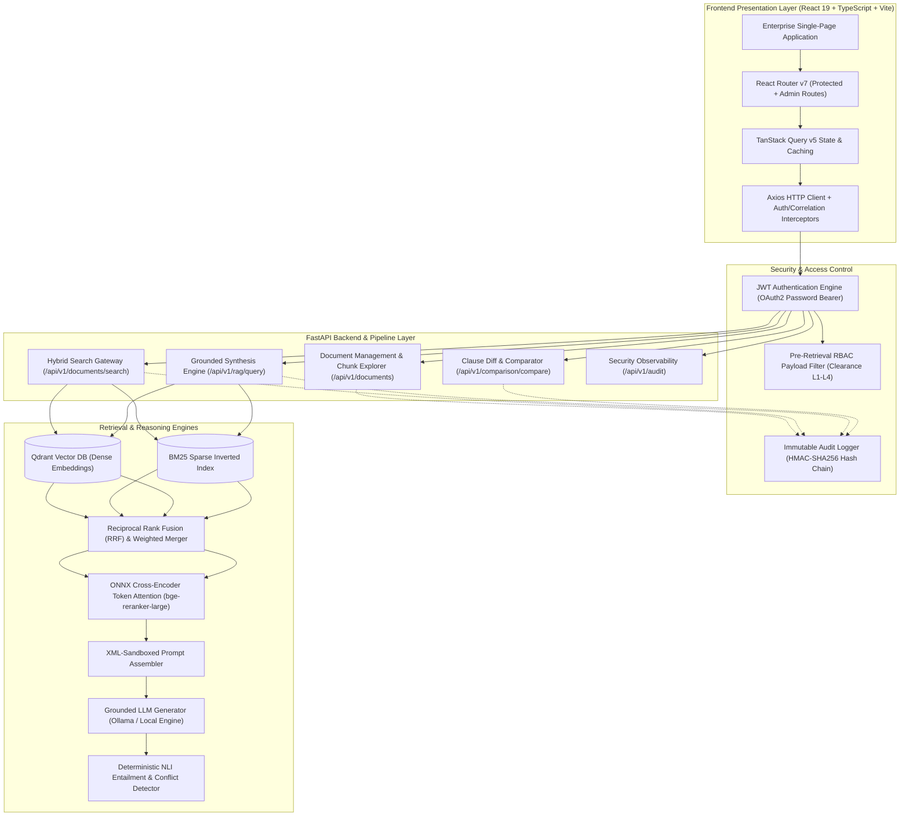

# AI-Powered Enterprise Document Intelligence & Knowledge Platform

[](#verified-backend-baseline)
[](#frontend-architecture--testing)
[](#phase-12--enterprise-frontend--product-ui)
[](#system-architecture)
[](#license)

> **Enterprise-Grade AI Document Intelligence, Hybrid Retrieval, Grounded Synthesis, and Cryptographic Security Observability**

---

## 📌 Project Overview

The **AI-Powered Enterprise Document Intelligence & Knowledge Platform** is a secure, high-precision document search, synthesis, version comparison, and compliance evaluation system designed for complex corporate document repositories (HR policies, SOPs, engineering runbooks, compliance filings, and vendor contracts).

### Core Architectural Principles
1. **The LLM is NOT the database**: The system retrieves authorized evidence with deterministic precision using a hybrid retrieval engine (BM25 + Qdrant) and cross-encoder reranking. The LLM operates strictly as a grounded reasoning and synthesis engine constrained to retrieved context.
2. **Pre-Retrieval RBAC Filtering**: Role-based access control (Tiers L1–L4) and department filters are enforced *before* vector and sparse searches execute, preventing data leakage and top-k starvation.
3. **Deterministic Grounding Verification**: Every generated claim is mapped to explicit document, page, and section citations with entailment validation and conflict detection.
4. **Immutable Audit Observability**: Complete, tamper-evident security telemetry with SHA-256 HMAC cryptographic chain verification.

---

## 🏗️ System Architecture



---

## 💻 Phase 12 — Enterprise Frontend & Product UI

The Phase 12 frontend is a responsive, dark-mode ready, enterprise SPA built with modern web technologies:

- **Framework**: React 19, TypeScript, Vite
- **Routing**: React Router DOM v7
- **Data Fetching & Cache**: TanStack Query v5
- **HTTP Client**: Axios with JWT automatic injection & `X-Request-ID` correlation tracing
- **Styling**: Tailwind CSS + Custom Design System Tokens
- **Icons**: Lucide React
- **Testing**: Vitest, React Testing Library, JSDOM

### Implemented Pages & Capabilities

| Page | Route | Description & Features |
| :--- | :--- | :--- |
| **Authentication** | `/login`, `/register` | JWT auth, show/hide password, client validation, self-registration restricted to Employee. |
| **Dashboard** | `/dashboard` | User greeting with clearance pill, quick navigation cards, backend `/health` telemetry, security stats. |
| **Document Management** | `/documents` | 50MB drag-and-drop file ingestion, deduplication handling, chunks explorer drawer, permanent deletion. |
| **Hybrid Search** | `/search` | Strategy selector (RRF, Weighted, Dense, Sparse), latency & telemetry diagnostics, ranked chunk cards. |
| **RAG Assistant** | `/rag` | Grounding status badge, Markdown synthesis with interactive citation chips (`[1]`), claim verification table, sources drawer. |
| **Document Comparison** | `/comparison` | Document selector or ad-hoc text input, similarity threshold slider, diff statistics (+, -, ~, !, =), divergence index, clause alignment. |
| **Audit & Security** | `/audit` | Clearance L4 Admin only, compliance telemetry cards, SHA-256 HMAC hash chain verification, sanitized metadata explorer. |
| **Profile** | `/profile` | Identity details, clearance hierarchy matrix (Tiers 1–4), session tokens, logout. |
| **Error Handling** | `/403`, `/404`, `/500` | Clearance violation screen with request escalation guidance, not found, and fatal error boundaries. |

---

## 🧪 Verification & Test Suite Baseline

### Backend Pytest Suite
```bash
# Total backend tests across Phases 1-12
pytest -v
# Result: 217 passed, 1 warning, 0 failures, 0 errors, 0 skipped
```

- **Phase 1–7**: 109 tests (Parsing, chunking, embeddings, BM25, Qdrant, RRF, Cross-Encoder)
- **Phase 8**: 36 tests (Grounded RAG synthesis, prompt assembly, anti-hallucination)
- **Phase 9**: 21 tests (Deterministic claims verification, citation mapping, conflict detection)
- **Phase 10**: 25 tests (Authentication, password hashing, JWT security, Pre-Retrieval RBAC)
- **Phase 11**: 22 tests (Audit logging, HMAC-SHA256 integrity verification, security observability)
- **Phase 12**: 11 tests (Document lifecycle API, chunks retrieval, search endpoints)

### Frontend Build & Lint Verification
```bash
cd frontend
npm.cmd run lint   # Passes cleanly: tsc -b with zero TypeScript errors
npm.cmd run build  # Passes cleanly: Vite production bundle compiled to dist/
```

---

## 🚀 Quickstart Guide

### Prerequisites
- Python 3.11+
- Node.js 18+ and npm
- PostgreSQL 16+
- Qdrant Vector Database (local or containerized)
- Ollama (optional, with `llama3:8b`)

### 1. Backend Setup
```bash
# Create and activate Python virtual environment
python -m venv .venv
.\.venv\Scripts\activate

# Install dependencies
pip install -r backend/requirements.txt

# Run database migrations
alembic upgrade head

# Start FastAPI server
uvicorn backend.app.main:app --host 0.0.0.0 --port 8000 --reload
```

### 2. Frontend Setup
```bash
cd frontend

# Install dependencies
npm install

# Run frontend development server
npm run dev

# The web UI will be available at http://localhost:5173
```

---

## 📄 License
This project is licensed under the [MIT License](./LICENSE).
